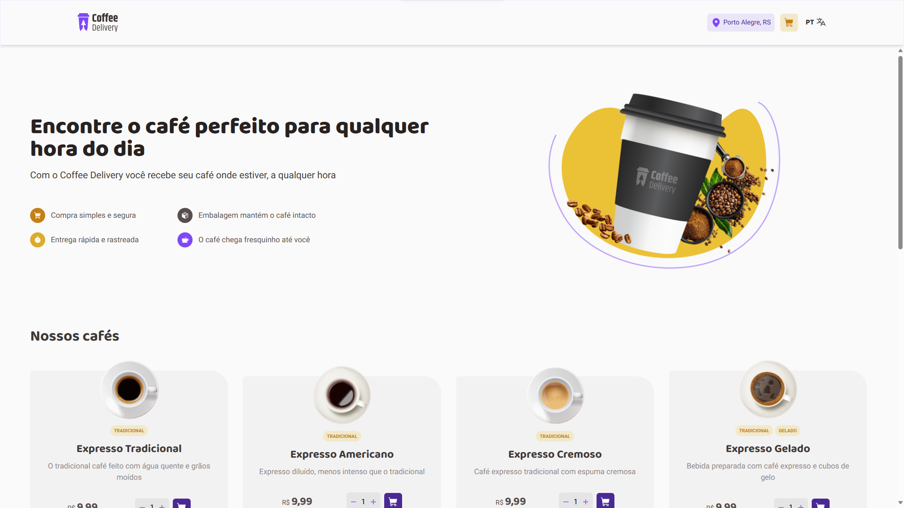
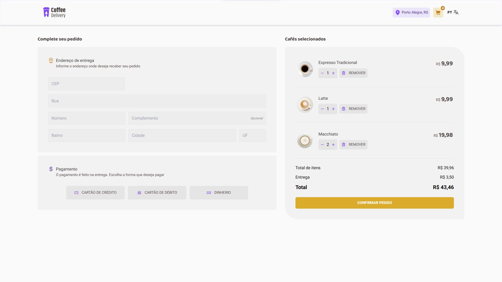
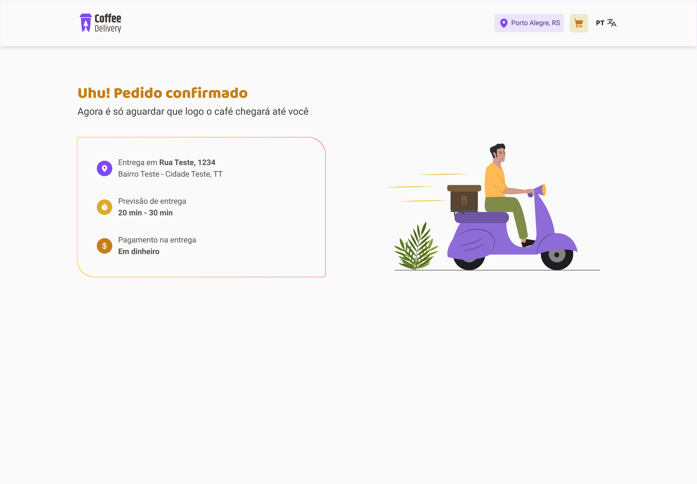
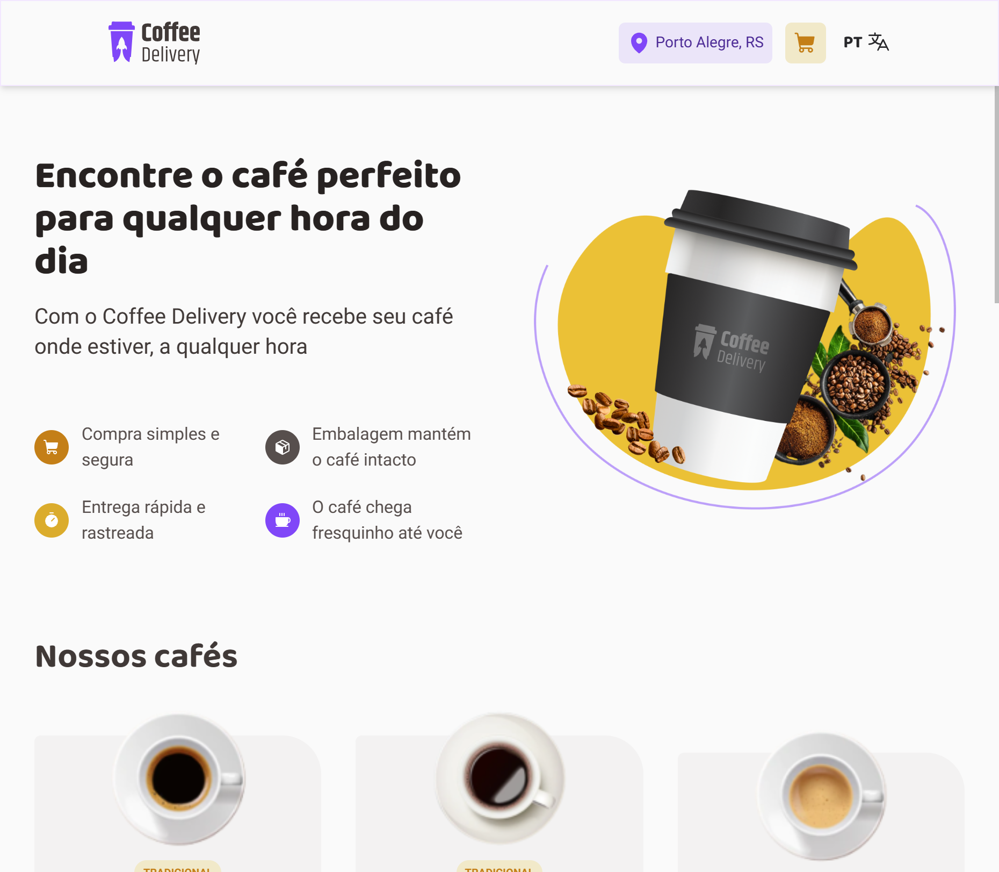
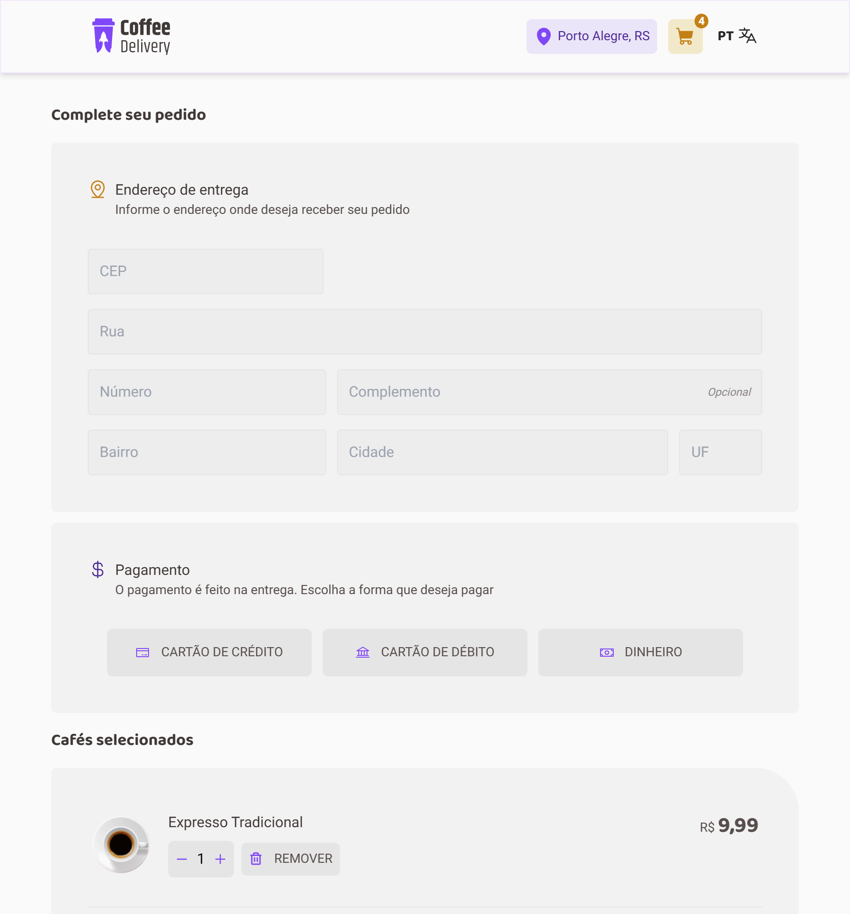
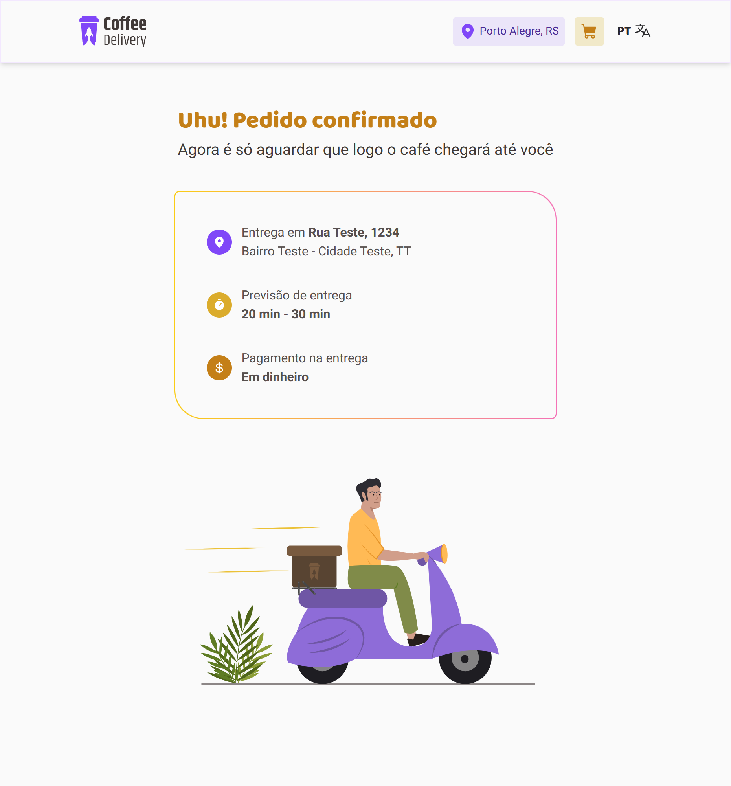
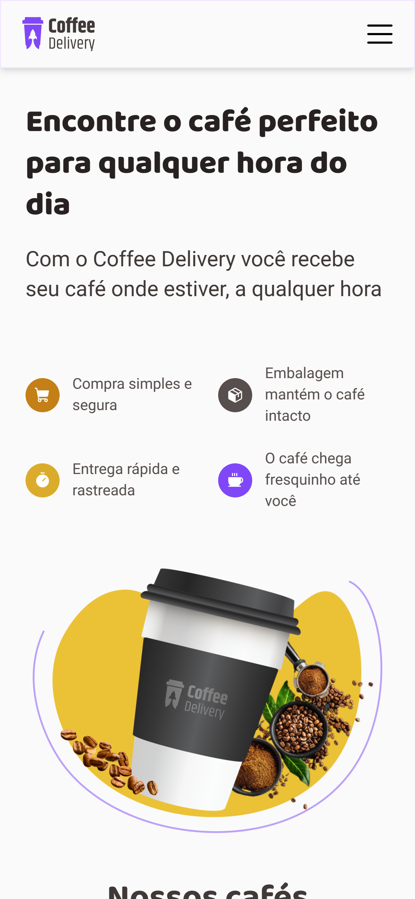
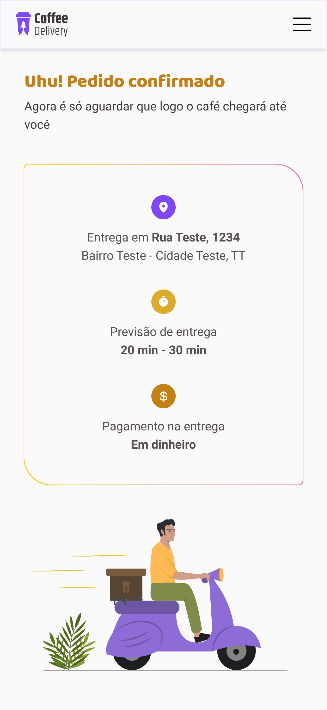

# Coffee Delivery

> For english speakers: [`click here`](./README_EN.MD)

Coffee Delivery é uma aplicação web para gerenciar um carrinho de compras de uma cafeteria fictícia, com a capacidade de ter multiplos idiomas acoplados na mesma interface, contando inicialmente com inglês e português.

**Acesse: [_Coffee Delivery App_](http://coffee-delivery-eddyyxxyy.vercel.app/).**

> Esse projeto é um dos desafios da trilha de React do Ignite. Ou seja, é fornecido somente um guia de estilos para o visual da aplicação e seu conceito. Todo o código, estrutura de pastas, dependências e técnicas de programação usadas são advindas de quem programa, de mim no caso.

## Previews

### Desktop:

#### Home:

#### Checkout:

#### Success:

### Tablet:

#### Home:

#### Checkout:

#### Success:

### Mobile:

#### Home:

#### Checkout:

#### Success:

## Uso

É simples, entre na aplicação, escolha entre uma variedade de cafés especiais disponíveis, sua quantidade e realize a "compra".

Você pode adicionar quantos cafés quiser, eles serão persistidas no carrinho por meio do armazenamento local do navegador. A vantagem disso é que não é necessário nenhuma forma de autenticação ou autorização para o uso do app, mas ao mesmo tempo gera problemas quando trocamos de navegador ou dispositivo, pois os cafés que escolhemos comprar não irão persistir entre dispositivos.

Sendo essa sua única limitação, o app oferece uma interface limpa, responsiva (que se encaixa em dispositivos móveis e ambientes desktop) e funcionalidade simples para o dia a dia.

> A escolha das animações e diversos detalhes da interface foram escolhidos e adaptados por mim, para atender às minhas expectativas e visão do projeto.

## Ambiente de Desenvolvimento

O foco aqui é o aprendizado no uso da Context API do React e dos conceitos de internacionalização por meio das libs i18next e react-i18next, além do aprendizado de estilização com Tailwind CSS.

- React;
- React Router Dom;
- Tailwind CSS;
- tailwind-variants;
- TypeScript;
- react-i18next;
- i18next;
- react-helmet-async;
- Commitlint;
- Husky;
- Prettier;
- ESLint;
- Vite;
- @phosphor-icons/react;

Além de configuração personalizadas para o ESLint e o plugins utilizados na checagem e formatação do código.

## Licença

Distribuído sob licença MIT. Veja [`LICENSE`](./LICENSE) para mais informações.

## Contato

Meus links:

- [Gmail](mailto:dev.eddyyxxyy@gmail.com?)
- [Github](https://github.com/eddyyxxyy)
- [LinkedIn](https://www.linkedin.com/in/eeddyyxxyy/)
- [Youtube](https://www.youtube.com/@eddyxide)
