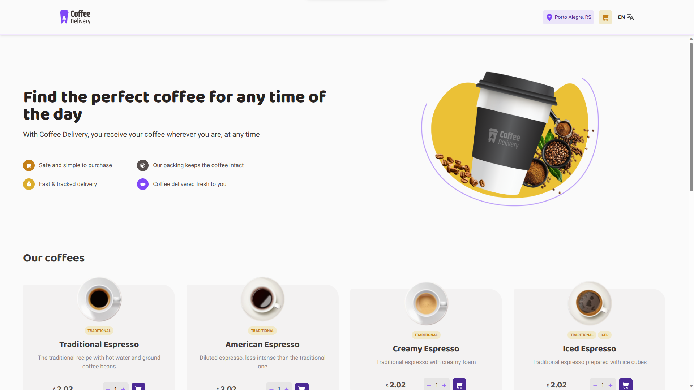
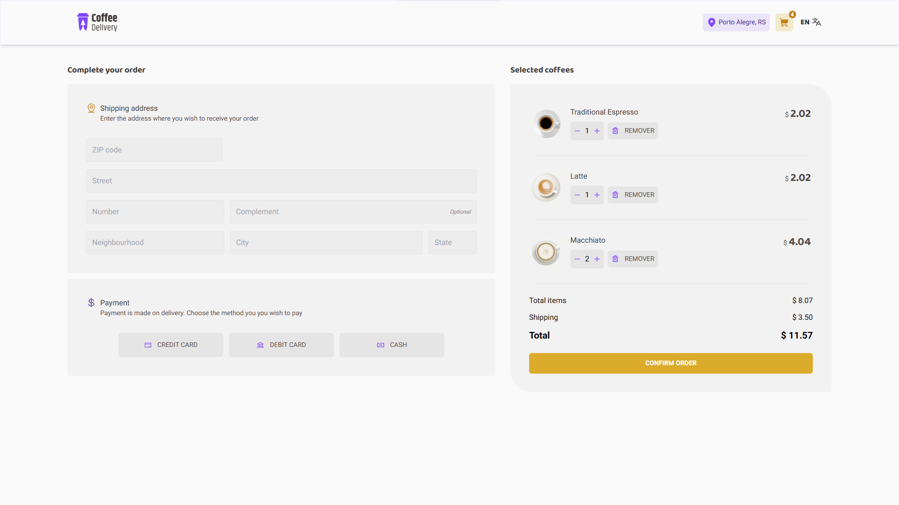
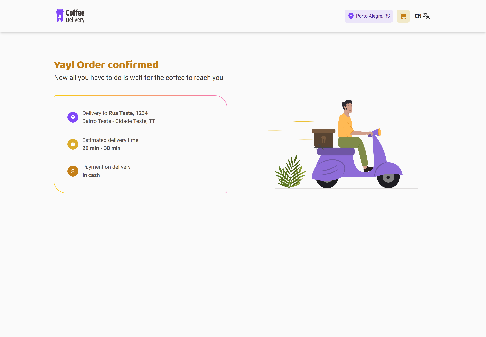
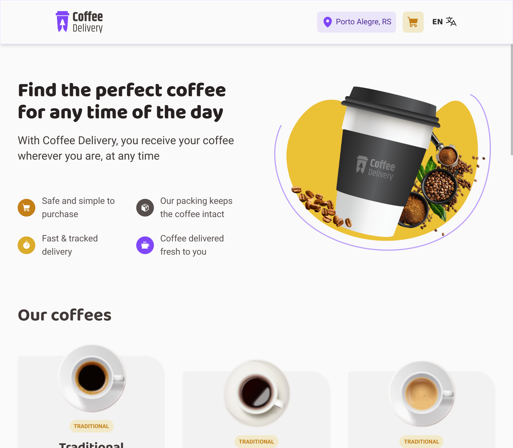
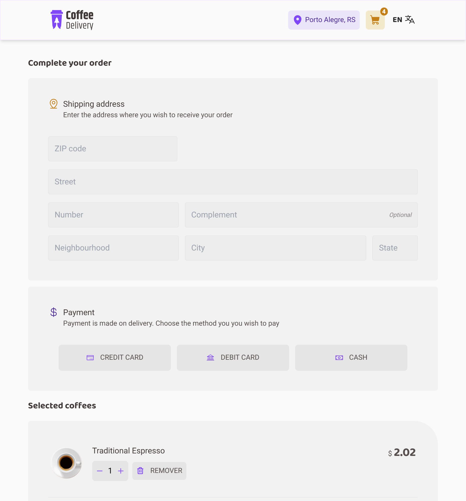
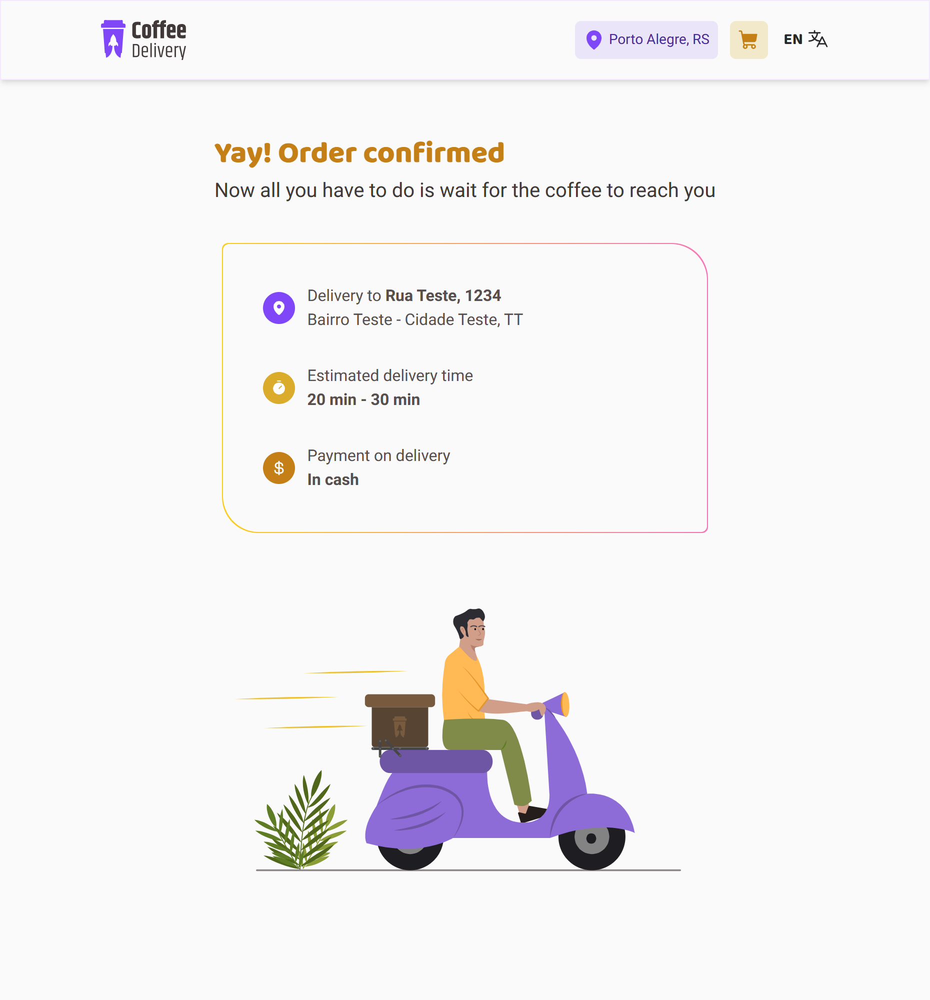
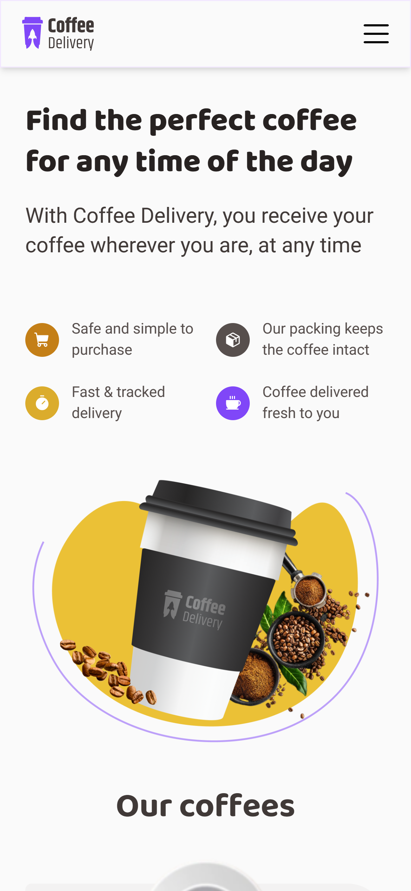
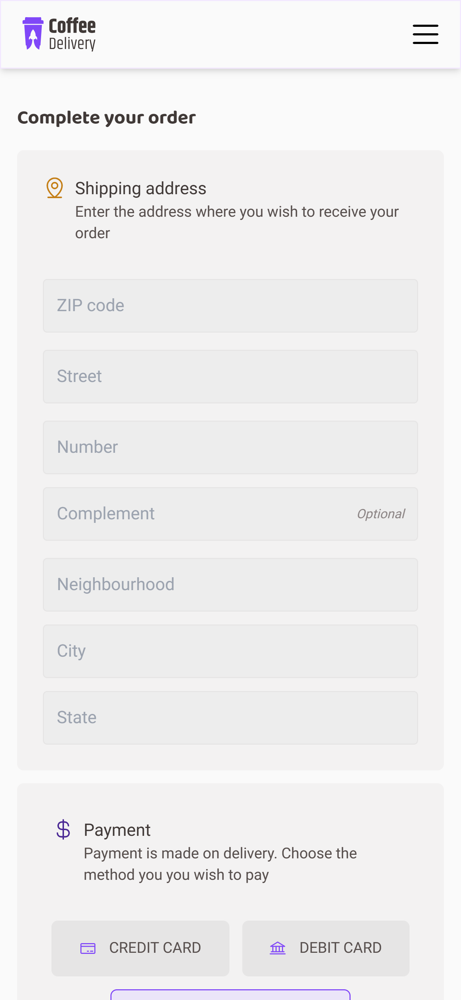
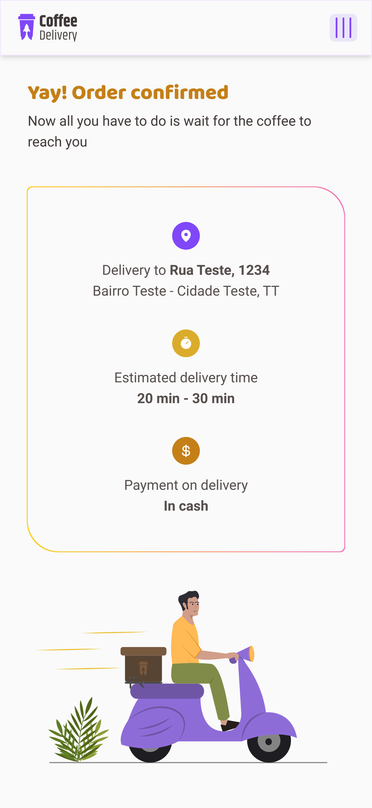

# Coffee Delivery

> Para falantes de português: [`click here`](./README_PT.MD)

Coffee Delivery is a web application for managing a shopping cart for a fictitious coffee shop, with the ability to have multiple languages attached to the same interface, initially counting on English and Portuguese.

**Access: [_Coffee Delivery App_](https://coffee-delivery-lac.vercel.app/).**

> This project is one of the challenges of the React track of Ignite. That is, only a style guide is provided for the application's visual and its concept. All the code, folder structure, dependencies, and programming techniques used are derived from the programmer, in this case, me.

## Previews

### Desktop:

#### Home:

#### Checkout:

#### Success:

### Tablet:

#### Home:

#### Checkout:

#### Success:

### Mobile:

#### Home:

#### Checkout:

#### Success:

## Usage

It's simple, enter the application, choose from a variety of special coffees available, their quantity, and realize the "purchase" process.

You can add as many coffees as you want, they will be persisted in the cart through the browser's local storage. The advantage of this is that no form of authentication or authorization is required for the use of the app, but at the same time it generates problems when we switch browsers or devices, as the coffees we choose to buy will not persist between devices.

Being its only limitation, the app offers a clean interface, responsive (which fits on mobile devices and desktop environments) and simple functionality for day-to-day use.

> The choice of animations and various details of the interface were chosen and adapted by me, to meet my expectations and project vision.

## Development Environment

The focus here is learning in the use of React's Context API and the concepts of internationalization through the libs i18next and react-i18next, in addition to learning styling with Tailwind CSS.

- React;
- React Router Dom;
- Tailwind CSS;
- tailwind-variants;
- TypeScript;
- react-i18next;
- i18next;
- react-helmet-async;
- Commitlint;
- Husky;
- Prettier;
- ESLint;
- Vite;
- @phosphor-icons/react;

In addition to custom settings for ESLint and the plugins used in code checking and formatting.

## License

Distributed under the MIT license. See [`LICENSE`](./LICENSE) for more information.

## Contact

My links:

- [Gmail](mailto:dev.eddyyxxyy@gmail.com?)
- [Github](https://github.com/eddyyxxyy)
- [LinkedIn](https://www.linkedin.com/in/eeddyyxxyy/)
- [Youtube](https://www.youtube.com/@eddyxide)
